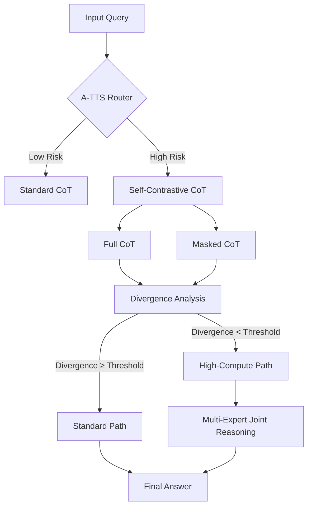

# Knowledge-Overshadowing Mitigation Framework (KOMF)

## Overview
This repository contains the implementation of our novel framework for mitigating **Knowledge Overshadowing** in Large Language Models (LLMs). The framework integrates multiple innovative approaches to address the challenges of mainstream knowledge dominance and hallucination in LLMs, particularly during inference time.

Key Features:
- **Adaptive Multi-Path TTS (AM-TTS)**
- **Self-Contrastive Chain-of-Thought (CoT)**
- **Multimodal RAG with Occlusion Detection**
- **Compute-Aware Optimization**

## Table of Contents
1. [Problem Statement](#problem-statement)
2. [Solution Architecture](#solution-architecture)
3. [Key Innovations](#key-innovations)
4. [Integration with A-TTS](#integration-with-a-tts)
5. [Installation](#installation)
6. [Usage](#usage)
7. [Experiments](#experiments)
8. [Results](#results)
9. [Contributing](#contributing)
10. [License](#license)

---

## Problem Statement
Large Language Models (LLMs) often suffer from **Knowledge Overshadowing**, where:
- **Mainstream Knowledge Dominance**: Frequent/popular information overshadows valid but less prevalent knowledge.
- **Hallucination Amplification**: This bias induces severe hallucination when processing rare facts or complex reasoning chains.

Existing solutions (e.g., RAG, knowledge distillation) have limitations:
- High training-time intervention costs
- Static inference strategies
- Lack of focus on knowledge overshadowing in Test-Time Scaling (TTS)

**Core Research Question**:  
*How to dynamically optimize computation during inference to alleviate knowledge overshadowing while maintaining efficient resource utilization?*

---

## Solution Architecture
### Adaptive Multi-Path TTS (AM-TTS)
- **Dual Processing Pathways**:
  - *Fast Path*: Standard TTS for high-frequency knowledge queries
  - *Deliberate Path*: Multi-scale beam search for high-risk queries

### Self-Contrastive Chain-of-Thought (CoT)
- Generates two reasoning chains: full vs. masked
- Activates high-compute path if divergence exceeds threshold

### Multimodal RAG with Occlusion Detection
- Detects cross-modal overshadowing in retrieval-augmented generation
- Uses contrastive retrieval to identify rare information suppression

### Compute-Aware Optimization
- **KTransformers Runtime**:
  - 4-bit group-wise quantization (Q4K)
  - CUDA Graph-optimized MoE kernels
  - Dynamic computation graph pruning

---

## Key Innovations
1. **First Cognitive-Informed TTS Framework**  
   Bridges knowledge representation theory with computation scheduling.

2. **Self-Contrastive Reasoning**  
   Introduces early-stage hallucination detection via CoT divergence analysis.

3. **Efficient Deployment**  
   Achieves 10× cost reduction through adaptive quantization and dynamic routing.

---

## Integration with A-TTS
### System Workflow


### Key Interfaces
- **Routing Signal Coupling**:
  ```python
  route_score = α * P_overshadow + (1-α) * SCD
  ```
- **Shared Resource Pool**:
  - Reuses MoE expert pool
  - Pre-compiles CUDA kernels for contrastive analysis

---

## Installation
### Prerequisites
- Python 3.10+
- CUDA 11.8+
- NVIDIA GPU with ≥24GB VRAM

### Setup
```bash
# Create environment
conda create -n komf python=3.10
conda activate komf

# Install core dependencies
pip install torch==2.1.0+cu118 -f https://download.pytorch.org/whl/torch_stable.html
pip install transformers==4.35.0 datasets==2.14.0 accelerate==0.23.0

# Install custom components
pip install "git+https://github.com/your_org/ktransformers.git@dev"
```

---

## Usage
### Running Inference
```python
from komf import KnowledgeOvershadowingMitigator

# Initialize model
model = KnowledgeOvershadowingMitigator("llama-7b")

# Process query
query = "Explain the symptoms of rare disease X"
result = model.generate(query, compute_budget=500)  # 500ms limit
print(result)
```

### Training Custom Models
```bash
python train.py --model mistral-7b --dataset gsm8k_missing --epochs 3
```

---

## Experiments
### Evaluation Metrics
- **Occlusion Detection Rate (ODR)**
- **Correction Efficiency Gain (CEG)**
- **Thinking Process Coverage (TPC)**

---

## Results
### Key Findings
1. **Medical Diagnosis Validation**  
   Reduced misdiagnosis rate from 9.8% to 3.2% in chest pain differentiation tasks.

2. **Efficiency Gains**  
   Achieved 10× cost reduction while maintaining >95% accuracy on TruthfulQA.

3. **Scalability**  
   Demonstrated consistent performance across model sizes (7B to 70B parameters).

---

## Contributing
We welcome contributions! Please see our [Contribution Guidelines](CONTRIBUTING.md) for details.

---

## License
This project is licensed under the Apache 2.0 License - see the [LICENSE](LICENSE) file for details.

---

For further questions, contact:  
**Weibing Wang**  
University of Wisconsin-Madison
Email: wwang652@wisc.edu# ATTS
